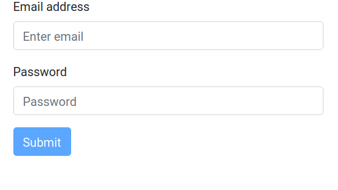
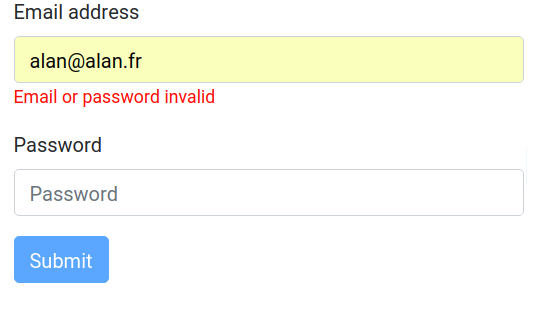
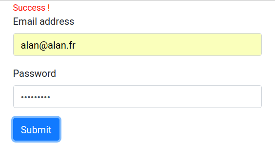

# Introduction aux formulaires

Nous allons maintenant introduire la notion de formulaire. Nous verrons plus tard la gestion des formulaires et des erreurs dans un contexte plus industrialisé en utilisant le module **Formik**.

En HTML les éléments de formulaire tels que input, textearea et select conservent leur propre état et sont mis à jour en fonction des données passées par l'utilisateur.

Dans React la gestion des "mutables" passera ici par un state avec setState pour sa mise à jour.

**Exemple de formulaire :**

```js

class Form extends React.Component {
  constructor(props) {
    super(props);
    this.state = { value: '' };

    this.handleChange = this.handleChange.bind(this);
    this.handleSubmit = this.handleSubmit.bind(this);
  }

    handleChange(event) {
      console.log(event.target)
      this.setState({ value: event.target.value });
    }

    handleSubmit(event) {
      console.log(`New User : ${this.state.value}`);
      event.preventDefault();
    }

  render() {
    return (
      <form onSubmit={this.handleSubmit}>
        <label>
          Username:
          <input type="text" value={this.state.value} onChange={this.handleChange} />
        </label>
        <input type="submit" value="Add" />
      </form>
    );
  }
}
```

## 1. Exercice formulaire User

Créez un formulaire pour ajouter à une liste user des utilisateurs, vous forcerez la saisie en majuscule dans le champ de saisie.

Vérifiez que l'utilisateur n'existe pas déjà dans la liste, si l'utilisateur se trompe alors affichez un message d'avertissement.

Gérez également le cas où le champ est vide dans l'ajout d'un utilisateur.

Affichez la liste des utilsateurs sous le formulaire, affichez dans un composant Users la liste.

Indication sur la structure de l'application (à faire dans un seul et unique fichier pour l'instant) :

```text
        App
         .
         .
       Form
         .
         .
       Users
```

Le composant Form pourrait ressembler à ceci :

```js
class Form extends React.Component {
  constructor(props) {
    super(props);
    this.state = { value: '', users : [] };

    this.handleChange = this.handleChange.bind(this);
    this.handleSubmit = this.handleSubmit.bind(this);
  }

    handleChange(event) {
      console.log(event.target)
      this.setState({ value: event.target.value });
    }

    handleSubmit(event) {
      console.log(`New User : ${this.state.value}`);
      event.preventDefault();
    }

  render() {
    return (
      <form onSubmit={this.handleSubmit}>
        <label>
          Username:
          <input type="text" value={this.state.value} onChange={this.handleChange} />
        </label>
        <input type="submit" value="Add user" />
        Affichez ici les utilisateurs
      </form>
    );
  }
}
```

## Textarea

La particularité d'un textarea en HTML c'est qu'il définit son contenu texte par une structure de type composition. React utilise l'attribut value pour définir la valeur d'un élément, vous utiliserez donc la syntaxe suivante avec cet élément :

```js
<textarea value={this.state.value} onChange={this.handleChange} />
```

## Select

En HTML classique on écrit :

```html
<select>
  <option selected value="devReact">Alan</option>
  <option value="devSymfony">Alice</option>
  <option value="devDjango">Naoudi</option>
  <option value="devAngular">Fenley</option>
</select>
```

En React vous écrirez la syntaxe suivante :

```js
// constructor
 this.state = {value: 'devReact'};

 // render
<select value={this.state.value} onChange={this.handleChange}>
  <option value="devReact">Alan</option>
  <option value="devSymfony">Alice</option>
  <option value="devDjango">Naoudi</option>
  <option value="devAngular">Fenley</option>
</select>
```

### Select multiple

Pour la gestion d'une sélection multiple, vous pouvez passer un array comme suit :

```js
<select multiple={true} value={['a', 'b', 'c']}>
```

La gestion de l'upload des fichiers sera vue plus tard dans le cours.

## Gestion des inputs multiples

On peut évidemment gérer les différentes valeurs des champs du formulaire en s'inspirant de ce que l'on vient de faire, mais dans ce cas la gestion des variables peut devenir compliquée selon la longueur du formulaire.

Vous pouvez cependant utiliser la syntaxe suivante pour contrôler la saisie des valeurs de plusieurs champs :

```js

// fields dans le state = { username : '', email : '' };

const { value, name } = event.target;

// Puis de manière dynamique
this.setState(
  { [name] : value }
)

```

## 2. Exercice formulaire de connexion

Récupérez le code ci-dessous et gérez une connexion **login/password** en React. Implémentez la gestion des erreurs.

```html
<!-- source bootstrap Twitter CSS v4.0 -->
<form>
  <div className="form-group">
    <label forHtml="exampleInputEmail1">Email address</label>
    <input type="email" className="form-control" id="exampleInputEmail1" aria-describedby="emailHelp" placeholder="Enter email" />
    <small id="emailHelp" className="form-text text-muted">We'll never share your email with anyone else.</small>
  </div>
  <div class="form-group">
    <label forHtml="exampleInputPassword1">Password</label>
    <input type="password" class="form-control" id="exampleInputPassword1" placeholder="Password" />
  </div>
  <button type="submit" className="btn btn-primary">Submit</button>
</form>
```

Pour la gestion des erreurs : le formulaire est valide si les deux champs sont remplis. Pour la vérification de l'email, la vérification se fera directement dans le code HTML avec le type email en HTML.

- Vérifiez le login/password pour valider le formulaire.

Voici différentes vues du projet pour vous aider :






